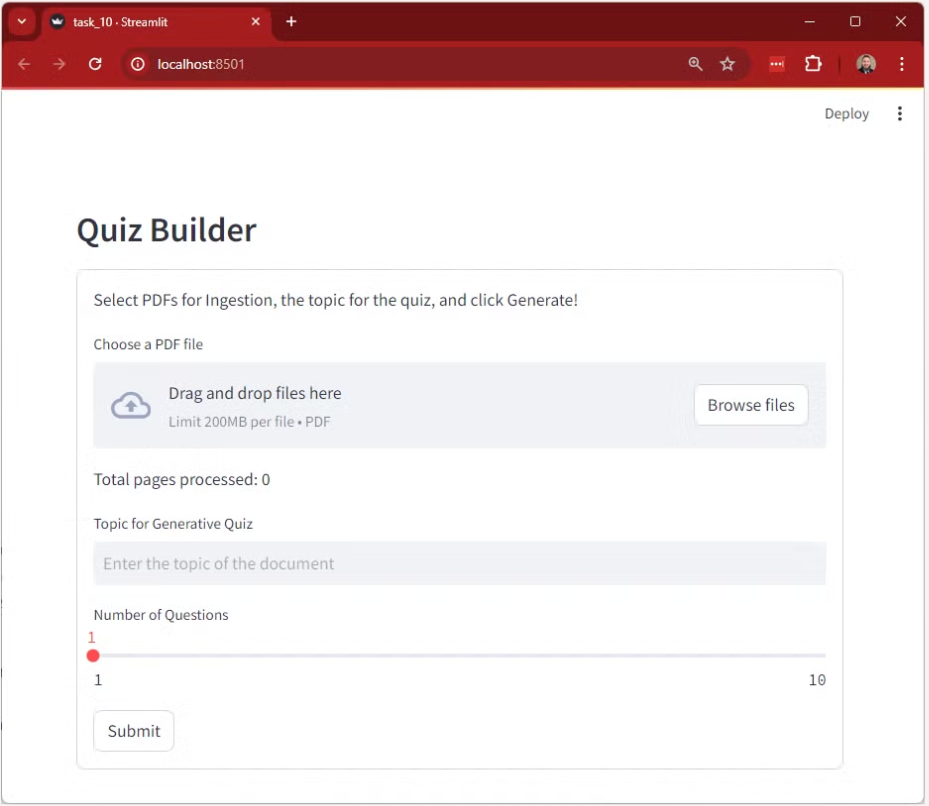

# Mission: Gemini Quizify

This is a guided mission part of Radical AI's Internship Program.

The original repository can be found here:
https://github.com/radicalxdev/mission-quizify

### <b>Project Status: Completed 5/18/2024</b>

## Streamlit Web Application

## Presentation

* [Presented by Jason Raimondi](https://youtu.be/7oCtnlkGJmo?t=00m00s)
  * Introduction
  * Live Web App Demo
  * Approach
  * Conclusion

## Installation

To create a copy of the repository on your local device, use the following commands:

`git init`

`git clone https://github.com/jeraimondi/radicalai-gemini-quizify.git`

## Project Intro

The lack of accessible and effective means for students and learners to reinforce their understanding of various topics. 
Recognizing the challenge of obtaining timely feedback and engaging in unlimited practice, the team is developing an 
AI-generated assessment and quiz tool. This tool aims to provide users with instant feedback and comprehensive explanations, 
thus facilitating deeper comprehension and retention of knowledge. By dynamically generating quizzes based on user-provided 
documents, ranging from textbooks to scholarly papers, the tool offers a tailored learning experience. The end result will 
be a user-friendly platform that empowers individuals to hone their skills, solidify their understanding, and ultimately 
excel in their academic pursuits.

## Project Objectives

* Provide accessible and effective means to reinforce understanding
* Provide instant feedback and comprehensive explanations
* Dynamically generate quizzes based on user-provided documents

## Contributors

* [Jason Raimondi](https://github.com/jeraimondi)

## Methods Used

* Generative AI (GenAI)
* Large Language Models (LLMs)
* Vector Databases (DBs)
* Retrieval-Augmented Generation (RAG)
* Semantic Search
* Object-Oriented Programming (OOP)
* Prompt Engineering

## Technologies

* Python
* Google Cloud Platform (GCP)
* Vertex AI
* Gemini
* Chroma
* LangChain
* Visual Studio Code (VSCode)
* Streamlit

## Project Description

This mission is broken down into four larger areas: the development environment setup, data pipeline, quiz generator, 
and user interface.

### Dev Environment Setup
All development is performed on my local Windows computer. I use VSCode as my Integrated Development Environment (IDE)
and Windows Subsystem for Linux (WSL) to enable development in a Linux environment directly from my Windows computer.
I create a local Python virtual environment, and I install the Google Cloud SDK to authenticate to and make use of
Google APIs.

### Data Pipeline
In order to provide context to the model to ground its responses, I construct the overall data pipeline. This pipeline 
consists of a number of classes and methods to first ingest user-provided PDF documents in the steamlit UI, create 
smaller "chunks" of the document text, of then which to create vectorized text embeddings and load them into an in-memory 
Chroma vector database.

### Quiz Generator
To generate the quiz, I create a custom class utilizing the Gemini Pro model, integrating it with the vector store for 
context. LangChain is used to create a prompt template, obtaining the provided topic from the user and utilizing the 
context in the vector store. LangChain Expression Language (LCEL) is used to simplify the code and also take advantage 
of parallelism when retrieving context from the vector store. This way, we are able to avoid having to search through 
all of the document chunks in a sequential manner which would take significantly longer.

### User Interface
Streamlit is used to create the UI. Streamlit is very efficient for prototyping and making incremental changes, so it is 
a great choice for this mission. The application can be run in the local web browser and can even be set to rerun 
automatically any time the code is modified.

## License

[MIT License](LICENSE)

## Acknowledgments
Thank you to the Radical AI team for your continued dedication, guidance, and 
support throughout this internship program.
